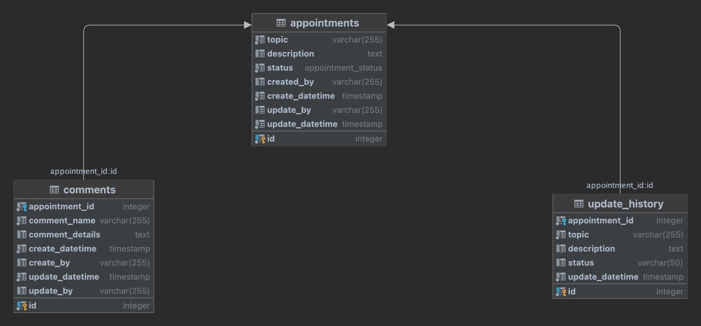
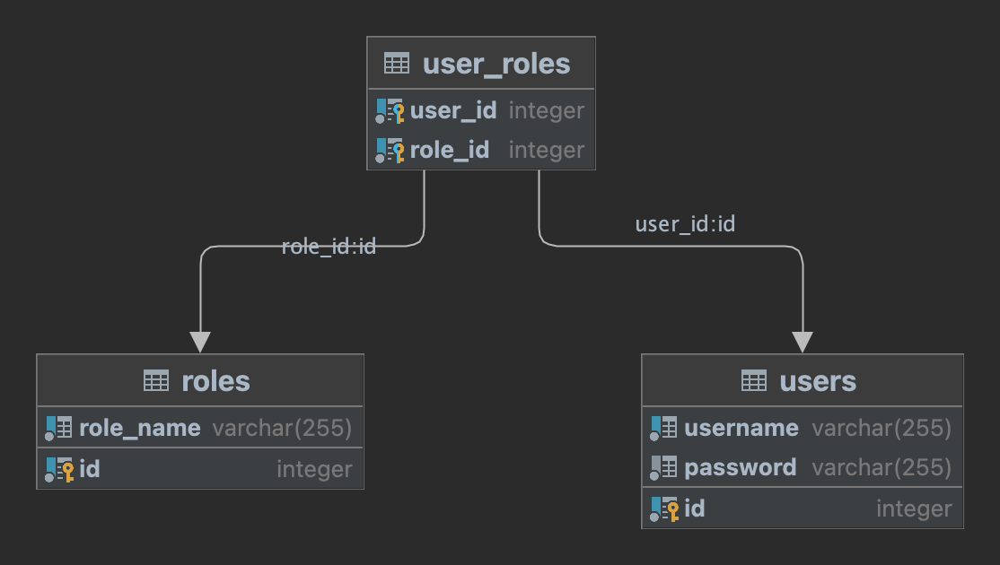

# ProfilePortal
ProfilePortal is a comprehensive recruitment management system.

## Features
 - **Appointment management**
 - **Commenting system**
 - **Role-based access control**: In API common check by user login
 - **Rate Limit**: :desinged on 1000 request per 1 hour

### Installing
```sh
 git clone https://github.com/jenwit07/ProfilePortalAPI
 cd ProfilePortalAPI
 docker-compose up -d
 ```

 The server should now be running on http://localhost:3000
  - Access Swagger Documentation at http://localhost:3000/profileportal/api-docs/
  - Generate a token and authorize before calling every API service, except for /v1/auth/register and /v1/auth/login.
  - Base credentials for generating a token are:
    - Username: `admin`
    - Password: `admin`

I also use Jest to Test profileportal-api,
```sh
 cd ProfilePortalAPI
 npm run test
 ```
 and, you can generate code coverage by command
 ```sh
 npm run test:coverage
 ```


### ProfilePortalAPI build with
 - Express.js
 - Sequelize
 - Jest
 - Supertest
 - express-openapi-validator
 - bcryptjs
 - jsonwebtoken
 - helmet

 ## Database: appointment-db
 - POSTGRES_DB: appointmentdb
 - POSTGRES_USER: dbadmin
 - POSTGRES_PASSWORD: test2024!

 ## Database: auth-db
 - POSTGRES_DB: authdb
 - POSTGRES_USER: dbadmin
 - POSTGRES_PASSWORD: test2024!

 ## ER Diagram
 - appointmentdb


 - authdb
